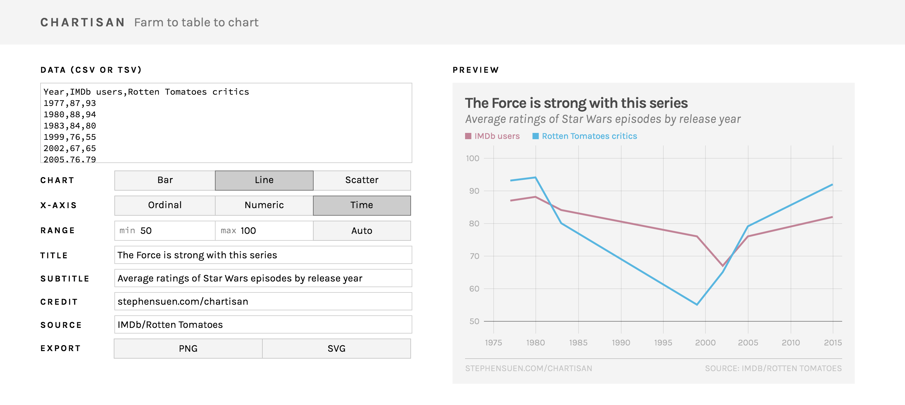

# C H A R T I S A N
#### Farm to table to chart with React + D3.

You know how pasta is supposed to taste better when you make it from scratch? This is basically the same thing, but instead of pasta I made my own version of Quartz's [Chartbuilder](https://github.com/Quartz/Chartbuilder).

What started out as a humble weekend hack project to learn [Webpack](https://github.com/webpack/webpack) snowballed into a full-fledged charting tool (because everyone's gotta have one) built with [React](https://github.com/facebook/react) and the new [D3 4.0](https://github.com/d3/d3). Aesthetically, the charts are mostly derived from the [Tachyons](https://github.com/tachyons-css/tachyons) CSS library, [FiveThirtyEight](https://fivethirtyeight.com) and [leather](https://github.com/wireservice/leather) but I'll be restyling all the things once I finish implementing baseline features. As a stretch goal I might add in some of the things mentioned in Gregor Aisch's [#NICAR15 lightning talk](http://vis4.net/blog/posts/seven-features-youll-wantin-your-next-charting-tool).

#### Changelog
* **0.6 (07/20/16)** — Fixed SVG positioning bug and added custom fonts to exported charts. 
* **0.5 (07/18/16)** — Now supports multiple series across all chart types, with a legend.
* **0.4 (07/14/16)** — Temporarily removed non-ordinal bar charts, fixed y-axis digit bug, added SVG/PNG exporting.
* **0.3 (07/07/16)** — Added basic time axis support (year only for now) and first pass at numeric bar charts, implemented customizable domain/range values.
* **0.2 (06/18/16)** — Added chart/axis switching, implemented line charts and scatterplots.
* **0.1 (06/14/16)** — First commit, MVP: Reactive D3 ordinal/numeric bar charts with some basic validation.

#### Feature Roadmap
* Support more sophisticated time-based x-scales (using Moment.js to parse)
* Display error messages in UI (currently just thrown in console)
* Customizable axes/ticks, color palettes, dimensions/sizing
* Responsive UI and responsive output
